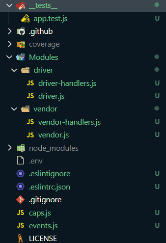

# Lab: Class 11

## Index

- [LAB: Event Driven Applications](#LAB:-Event-Driven-Applications)
- [Business Requirements](#Business-Requirements)
- [Phase 1 Requirements](#Phase-1-Requirements)
- [Technical Requirements / Notes](#Technical-Requirements-/-Notes)
- [The lab tree](#The-lab-tree)
- [Testing](#Testing)
- [More about the Lab](#More-about-the-Lab)
  - [Author](#Author)
  - [Github](#Github)
  - [UML](#UML)
  - [Tests](#Tests)
  - [Tests](#App)
- [Author Links](#Author-Links)

---

# LAB: Event Driven Applications

**CAPS Phase 1:** Begin the build of an application for a company called **CAPS** - The Code Academy Parcel Service. In this sprint, we'll build out a system that emulates a real world supply chain. **CAPS** will simulate a delivery service where vendors (such a flower shops) will ship products using our delivery service and when our drivers deliver them, be notified that their customers received what they purchased.

Tactically, this will be an event driven application that "distributes" the responsibility for logging to separate modules, using only events to trigger logging based on activity.

**[⬆ Back to Index](#index)**

## Business Requirements

Refer to the [CAPS System Overview](../../apps-and-libraries/caps/README.md) for a complete review of the application, including Business and Technical requirements along with the development roadmap.

**[⬆ Back to Index](#index)**

## Phase 1 Requirements

Today, we begin the first of a 4-Phase build of the CAPS system, written in Node.js. In this first phase, our goal is to setup a system of events and handlers, with the intent being to change out the eventing system as we go, but keeping the handlers themselves largely the same. The task of "delivering a package" doesn't change (the handler), even if the mechanism for triggering that task (the event) does.

The following user/developer stories detail the major functionality for this phase of the project.

- As a vendor, I want to alert the system when I have a package to be picked up
- As a driver, I want to be notified when there is a package to be delivered
- As a driver, I want to alert the system when I have picked up a package and it is in transit
- As a driver, I want to alert the system when a package has been delivered
- As a vendor, I want to be notified when my package has been delivered

And as developers, here are some of the development stories that are relevant to the above

- As a developer, I want to use industry standards for managing the state of each package
- As a developer, I want to create an event driven system so that I can write code that happens in response to events, in real time

**[⬆ Back to Index](#index)**

## Technical Requirements / Notes

Create the CAPS system as follows:

- `events.js` - Global Event Pool (shared by all modules)
- `caps.js` - Main Hub Application
  - Manages the state of every package (ready for pickup, in transit, delivered, etc)
  - Logs every event to the console with a timestamp and the event payload
  - i.e.  "EVENT {}"
- `vendor.js` - Vendor Module
  - Declare your store name (perhaps in a .env file, so that this module is re-usable)
  - Every 5 seconds, simulate a new customer order
    - Create a fake order, as an object:
      - storeName, orderId, customerName, address
    - Emit a 'pickup' event and attach the fake order as payload
      - HINT: Have some fun by using the [faker](https://www.npmjs.com/package/faker) library to make up phony information
  - Monitor the system for events ...
    - Whenever the 'delivered' event occurs
      - Log "thank you" to the console
- `driver.js` - Drivers Module
  - Monitor the system for events ...
  - On the 'pickup' event ...
    - Wait 1 second
      - Log "DRIVER: picked up [ORDER_ID]" to the console.
      - Emit an 'in-transit' event with the payload you received
    - Wait 3 seconds
      - Log "delivered" to the console
      - Emit a 'delivered' event with the same payload

When running, your console output should look something like this:

```javascript
EVENT { event: 'pickup',
  time: 2020-03-06T18:27:17.732Z,
  payload:
   { store: '1-206-flowers',
     orderID: 'e3669048-7313-427b-b6cc-74010ca1f8f0',
     customer: 'Jamal Braun',
     address: 'Schmittfort, LA' } }
DRIVER: picked up e3669048-7313-427b-b6cc-74010ca1f8f0
EVENT { event: 'in-transit',
  time: 2020-03-06T18:27:18.738Z,
  payload:
   { store: '1-206-flowers',
     orderID: 'e3669048-7313-427b-b6cc-74010ca1f8f0',
     customer: 'Jamal Braun',
     address: 'Schmittfort, LA' } }
DRIVER: delivered up e3669048-7313-427b-b6cc-74010ca1f8f0
VENDOR: Thank you for delivering e3669048-7313-427b-b6cc-74010ca1f8f0
EVENT { event: 'delivered',
  time: 2020-03-06T18:27:20.736Z,
  payload:
   { store: '1-206-flowers',
     orderID: 'e3669048-7313-427b-b6cc-74010ca1f8f0',
     customer: 'Jamal Braun',
     address: 'Schmittfort, LA' } }
...
```

**[⬆ Back to Index](#index)**

#### **The lab tree**

- 

**[⬆ Back to Index](#index)**

#### **Testing**

- Console log the pickup details, when pickup event is on
- Should console log that the DRIVER: picked up [as an example{4ea998b3-1b15-4a05-bc23-ac60a0e2c210}], when pickup event is on
- Should console log the in-transit details, when in-transit event is on
- Should console log that the DRIVER: delivered up [as an example{4ea998b3-1b15-4a05-bc23-ac60a0e2c210}], when delivered event is on
- Should been called with the previous console log

**[⬆ Back to Index](#index)**

### **More about the Lab**

- #### Author
  - Shady Khaled

  **[⬆ Back to Index](#index)**
- #### Github

  - For the repo ***caps*** clicks => [here](https://github.com/shadykh/caps).
  - Pull Requests:
    - [https://github.com/shadykh/caps/pull/2](https://github.com/shadykh/caps/pull/2)
    - GitHub actions:
      - [https://github.com/shadykh/caps/runs/2680053839?check_suite_focus=true](https://github.com/shadykh/caps/runs/2680053839?check_suite_focus=true)
      - [https://github.com/shadykh/caps/runs/2680055833?check_suite_focus=true](https://github.com/shadykh/caps/runs/2680055833?check_suite_focus=true)
      - [https://github.com/shadykh/caps/runs/2680056537?check_suite_focus=true](https://github.com/shadykh/caps/runs/2680056537?check_suite_focus=true)
  - Local Tests:
    - 
  - GitHub Tests:
    - 
  - Output:
    - 

**[⬆ Back to Index](#index)**

- #### UML

  - 

**[⬆ Back to Index](#index)**

- #### Tests

  - run `npm test`
  - Test code ➡️ [app.test.js](./__tests__/app.test.js)

**[⬆ Back to Index](#index)**

- #### App

  - run `node caps.js`

- I did this lab with help of
  - dependencies
    - dotenv
    - faker
  - devDependencies
    - supertest
    - jest
    - eslint
  - framework
    - Node.js
  - tools
    - Github.
    - VsCode.
    - Ubuntu.

**[⬆ Back to Index](#index)**

<br>

---
<br>

## Author Links

- ### Shady Khaled github ✅

  - [Shady Khaled](https://github.com/shadykh)

- ### Shady Khaled reading notes 📚

  - [Shady Khaled reading notes](https://shadykh.github.io/reading-notes/)

- ### Shady Khaled portfolio 💬

  - [Shady Khaled portfolio](https://portfolio-shady.herokuapp.com/)
